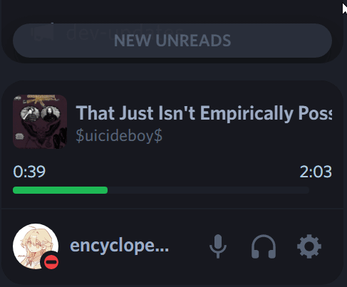

<p>
  <h1 align="center">SpotifyModal</h1>
</p>

<p align="center">
  <a href="https://replugged.dev/install?identifier=lib.evelyn.SpotifyModal">
    
  </a>
</p>

<p align="center">
  a Replugged plugin that shows a little modal on your user dock that lets you see & control
what you're playing on Spotify.
</p>

## Credits

- the plaintext patch for the modal is taken from
  [Vencord's spotifyControls](https://github.com/Vendicated/Vencord/blob/main/src/plugins/spotifyControls/index.tsx#L49-L57)

## Preview



## Customization

there exists a settings menu which allows for a certain degree of customization.

element dom tree (use this to create css selectors):

- `(...)`: means `...` might be omitted.

```html
<div id="spotify-modal-root">
  <!-- if modal is hidden / track is nullish -->

  <div id="spotify-modal" class="spotify-modal (hidden)">
    <div class="placeholder">
      <svg class="icon spotify">
        <path fill="currentColor" d="..." />
      </svg>

      <div class="text">
        <!-- header -->
        <span class="main">...</span>

        <span class="sub">...</span>
      </div>
    </div>
  </div>

  <!-- else -->

  <div id="spotify-modal" class="spotify-modal">
    <div class="main">
      <div class="track-details (cover-art-expanded)">
        <span class="cover-art-container (expanded)">
          <span class="cover-art-tooltip">
            
          </span>

          <span class="expand-collapse-button-tooltip (hidden)">
            <!-- only one of these may exist at a time -->

            <svg class="icon expand-icon (disabled)">
              <path fill="currentColor" d="..." />
            </svg>

            <svg class="icon collapse-icon (disabled)">
              <path fill="currentColor" d="..." />
            </svg>
          </span>
        </span>

        <div class="title-artists">
          <a class="title (href)">...</a>

          <span class="artists">
            <a class="artist">...</a>
          </span>
        </div>
      </div>

      <div class="seekbar-container (hidden)">
        <div class="seekbar-timestamps">
          <span class="progress">...</span>

          <span class="duration">...</span>
        </div>

        <div class="seekbar">
          <div class="grabber">...</div>

          <div class="inner">
            <!-- seekbar progress -->
            <div></div>
          </div>
        </div>
      </div>

      <div class="controls-container (hidden)">
        <svg class="play-icon (disabled)">
          <path fill="currentColor" d="..." />
        </svg>

        <svg class="pause-icon (disabled)">
          <path fill="currentColor" d="..." />
        </svg>

        <svg class="skip-next-icon (disabled)">
          <path fill="currentColor" d="..." />
        </svg>

        <svg class="shuffle-on-icon (active) (disabled)">
          <path fill="currentColor" d="..." />
        </svg>

        <svg class="shuffle-off-icon (disabled)">
          <path fill="currentColor" d="..." />
        </svg>

        <svg class="no-icon">
          <path fill="currentColor" />
        </svg>
      </div>
    </div>
  </div>

  <div class="divider"></div>
</div>
```

## Known issues

- "smart" shuffle state doesn't show in the modal - we do not receive any info about this shuffle
  state through the websocket connection at the moment.
- leaving Spotify inactive for an hour or so will make the controls stop working until you manually
  update the player state in the Spotify app
  - fix: enable `Automatic Reauthentication` in `Settings`
- the progress bar can be off by 1s - 5s at times when the Discord app lags and the Spotify state
  updates.
  - fix: none - we cannot trust Spotify's timestamps. they are wildly inaccurate for some reason
- the modal does not update while playing episodes (shows)
  - fix: none - we don't get the item data for the episode at all (`null`). check it yourself by
    executing
    ```js
    replugged.plugins
      .getExports('lib.evelyn.SpotifyModal')
      .util.events.on('message', (ev) =>
        console.log(ev.detail.currently_playing_type, ev.detail.item),
      );
    ```
- what happened to the `no Spotify pause` feature?
  - removed. you should check out
    [`NoSpotifyPause`](https://github.com/Socketlike/replugged-plugins/blob/main/plugins/NoSpotifyPause)
    instead.

## Miscellaneous

- right clicking...
  - on the cover art copies the currently playing album URL, if there's any
  - on the song title copies the currently playing song's URL
  - on an artist's name copies the artist's user URL
  - on any empty spot in the modal allows you to view the controls context menu
- clicking on the progress bar allows you to set current playback position

## Roadmap

- [x] basic functionality
- [x] progress bar
- [ ] controls
  - [x] play / pause
  - [x] skip forward / backward
  - [x] shuffle
  - [x] repeat
  - [x] seeking
    - [x] clicking on bar
    - [x] scrubbing
  - [ ] like / unlike ([docs/SCOPES](docs/SCOPES.md))
  - [x] volume control
- [ ] custom oauth2 access tokens ([docs/AUTHORIZATION](docs/AUTHORIZATION.md))
