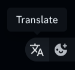

  <h1 align="center">Translator</h1>

  

  a Replugged plugin that allows you to translate messages in-app.

## Usage

- translating others messages: hover over a message and click on the "Translate" popover button. to
  untranslate, click the same popover button again.

- translating your sent messages: click on the

## Limitations

- if you translate your own sent messages and try to edit them, the translated message would be in
  the edit field (avoid this by untranslating before you edit)
