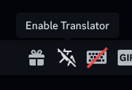

  <h1 align="center">Translator</h1>

  

  a Replugged plugin that allows you to translate messages in-app.

## Usage

**configure your desired languages in the plugin settings first**. then you may:

- translate others' messages to your language: hover over a message and click on the "Translate"
  popover button. to untranslate, click the same popover button again.

 

- translate your messages to others' language: enable the translator by clicking on the
  `Enable Translator` button in the chat bar.

## Limitations

- if you translate your own messages by using the `Translate` popover button and try to edit them,
  the translated message would be in the edit field (avoid this by pressing the `Untranslate`
  popover button before you edit)
- if you reply to a translated message, the replied message preview will show the original,
  untranslated message content
